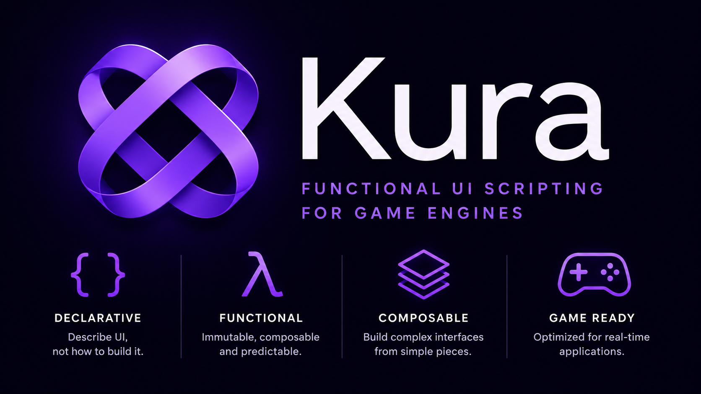

# Kura

> A declarative, purely functional DSL for game engine UIs.



Inspired by:

- Elm
- Haskell
- Typst
- React
- ImGui
- Flutter

Kura natively combines compositional functional programming with expressive layout primitives & deterministic rendering.

***Warning***: Under active development. Expect breaking changes and evolving ABIs

```kui
view Main =
  #column[
    text title "Kura"

    button[
      text "Start Game"
    ]

    button[
      text "Settings"
    ]
  ]
```

## Wiki

See the [wiki](https://github.com/s0cks/kura/wiki) for more information.

## Blog

Check the development [blog](https://kura.tazz.codes) for updates, architectural discussions and more information.

## License

See [LICENSE](LICENSE).
