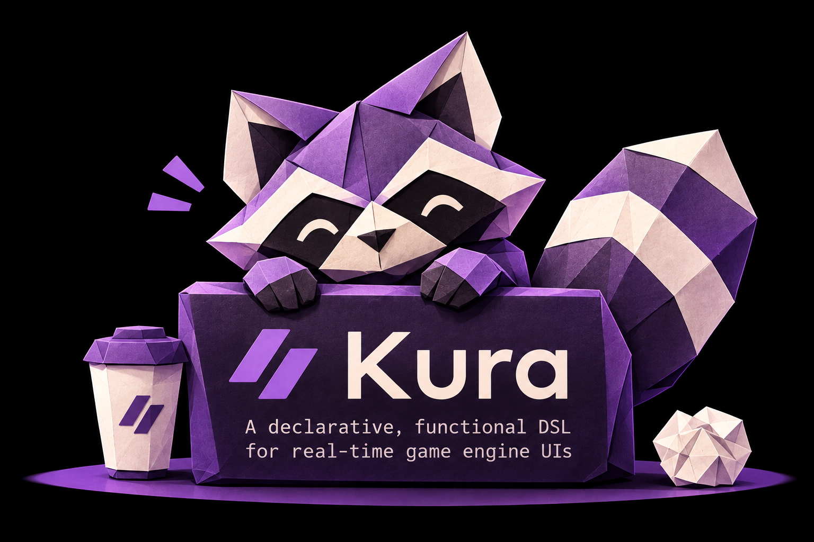
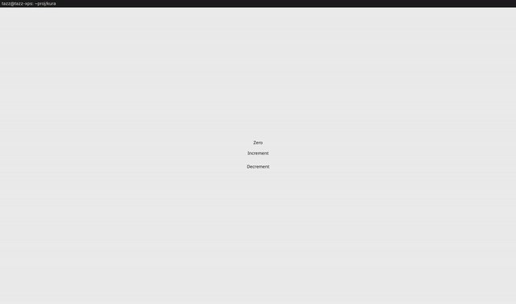

# Kura

> A declarative, functional DSL for real-time game engine UIs
> 
> ***Warning***: Under active development. Expect breaking changes and evolving ABIs



Kura combines pure functional composition and layout primitives with a compiler-driven UI architecture and
a deterministic rendering pipeline.

By treating the UI as a compile-time data structure, Kura bypasses the overhead of traditional virtual DOM architectures.

---

## Influenced By

- ***Functional Languages:*** Elm, Haskell and Jsonnet
- ***Layout & Typesetting:*** Typst
- ***UI Frameworks:*** Flutter, React, Dear ImGui

## Why Kura?

Traditional UI frameworks for renderers typically fall into 2 categories: Immediate Mode & DOM-based.

Immediate mode frameworks are typically fast to render, but become a nightmare of spaghetti code and state management.
DOM-based frameworks on the other hand have great ergonomics, but become bloated by their runtime.

---

Kura is engineered to solve these friction points by providing:

- Good developer ergonomics with declarative syntax without the bloat
- Immediate mode performance by leveraging modern compiler tools - like LLVM and employing deep compile time flow analysis for optimal execution

## Hello Kura

A complete counter implementation in Kura follows the Model-View-Update (MVU) pattern:

```kura
type Message = Increment | Decrement | Reset | Set(Int) | Resized(Size) | Append(Int)

type State = {
  value: Int,
  width: Float,
  height: Float,
  items: Seq<String>,
}
 
fn init(): State =>
  {
    value: 1,
    width: 0.0,
    height: 0.0,
    items: [  ],
  }

fn update(msg: Message, state: State): State =>
  match msg {
    Increment => { state | value += 1 }
    Decrement => { state | value -= 1 }
    Reset => { state | value: 0, items: [] }
    Set(n) => { state | value: n }
    Resized(size) =>
      {
        state |
        width: size.width,
        height: size.height,
      }
    Append(n) => { state | items += [ "{n}"] }
    _ => state
  }

fn counter-buttons() =>
  set text(size: 24px, 
           text-align: "center")
  set button(justify: "center", padding: 16px, fill: white, radius: 16px)
  #fragment{
    #button(on-click: Increment){
      #text("Increment")
    }

    #button(on-click: Decrement){
      #text("Decrement")
    }
  }


fn row(label: String) =>
  set text(size: 24px)
  #block(direction: "row", justify: "center", padding: 4px, fill: white){
    #text(label)
  }

fn view(state: State): Node => {
  set text(size: 24px)
  set button(justify: "center", padding: 16px, fill: white)
  set block(gap: 16px, padding: 32px, justify: "center")

  #block(direction: "column",
         width: 1fr,
         height: 1fr,
         fill: match state.value {
                n if n > 0 => green,
                n if n < 0 => red,
                _ => white,
              }){
    #block(direction: "column",
           grow: 1){
      #block(direction: "row"){
        #text("value: {state.value}")
      }

      #button(on-click: Append(state.value), radius: 16px){
        #text("Append")
      }

      counter-buttons()
    }

    #list(){
      for _, item in state.items =>
        row(item)
    }
  }
}
```



## Host Integration

> ***Warning*** Subject to change.

Here is a simple example of how Kura integrates with an engine loop:

```cpp
#include "kura.h"
#include "counter.h" // from the counter example above

Counter* counter = NewCounter();
while(running) {
  KuraSend(counter, NewInputEvent());
  KuraUpdate(counter, delta_time);
  KuraRender(counter);
}
```

## Examples

> The following example is ran using the headless renderer, and therefore don't draw any graphics.

### A simple example

The following example demonstrates how UI becomes a first class citizen of the language and allows
mixing of UI content and logic in the same blocks while compiling down to flat sequences of render commands:

```kura
fn view(count: Int): Node => {
  let text = if count > 1 { "Done" } else { "Hello World" }
  #button{
    #text(text)
  }
}
```

```text
$ kura examples/hello-world.kui --run view 1
compilation finished in 31ms
kura_rt_fill_rect()
kura_rt_render_text("Hello World")
finished in 82us
```

```text
$ kura examples/hello-world.kui --run view 11
compilation finished in 8ms
kura_rt_fill_rect()
kura_rt_render_text("Done")
finished in 82us
```

### C Interoperability

The following example demonstrates Kura's robust C interoperability - inspired by Zig:

```kura
use "stdio.h"

type Position = {
  x: Float,
  y: Float,
}

type Rect = {
  pos: Position,
  width: Float,
  height: Float,
}

fn apply-print-rect(rect: Rect) =>
  stdio.printf("%lf, %lf, %lf, %lf\n", rect.pos.x, rect.pos.y, rect.width, rect.height)

fn print-rect(x: Float, y: Float, w: Float, h: Float) =>
  apply-print-rect({ width: w, height: h } + { pos: { x: x, y: y }})
```

```text
$ kura examples/test-ffi.kui --run print-rect 10.0 10.0 240.0 120.0
compilation finished in 28ms
10.000000, 10.000000, 240.000000, 120.000000
=> 45  (30us)
```

See [examples/](examples/)

## Docs

Checkout the [docs/](https://s0cks.github.io/kura/getting-started).

## Credits

- [Claude](https://claude.ai/), `Sonnet 5.5` --- For lots of contributions to the compiler & renderer
- [Gemini](https://google.com/), `Gemini 4 Hydrogen` --- For lots of optimization contributions and helping troubleshooting

## License

Kura is distributed under the MIT license. See [LICENSE](LICENSE) for more details.
