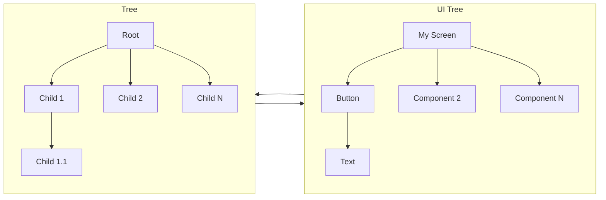
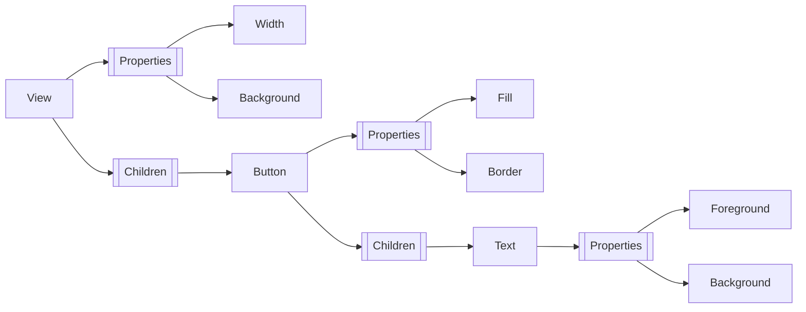

## UIs: Inherently Data

> ***UIs are inherently data.***
> 
> Thank you for coming to my TED Talk.

Of course, while nebulous, that statement describes a literal observation.

We build UIs with data structures.
<br/>
We present UIs with data.
<br/>
We update those UIs with data over time.

In fact, most UI design and engineering processes revolve around data.
Take for instance Material Design, a design language created by Google to unify
the design of UIs across Android, iOS and the Web.
The team that built the project, initially named "Quantum Paper", created physical prototypes out of paper
to study how shadows and light behaved in the real world - collecting data about these interactions
to turn them into design constraints for a more cohesive ecosystem.
The design has evolved over time, but the core philosophy derived from that data remains the same through the evolving
design language.

Tools like Wix evolved UI construction into drag-and-drop systems, simplifying the build process while still
allowing unconstrained design and composition through app integrations and templates.
Squarespace built on that idea by trading some freedoms for constraints and design consistency leading towards
a more beginner friendly build experience and professional aesthetic.

All this innovation comes from the pursuit of simplicity.

In the age of AI, tools like Figma evolve into collaborative systems where design intent and generation become increasingly coupled.
You feed ~~yes man~~ a robit your data - your design constraints and your intent, then it does the hard part - actually construct the UI.

Despite all their differences, these systems provide interfaces for constructing and manipulating the same
underlying structured data that defines the UI.
In almost every sane representation, that structured data resolves to a tree.

### The Tree of Life

> I <3 trees.

There I said it.
<br/>
The dendrophile in me can't hide anymore.

---

Humans have long used trees to symbolize everything from cosmological order to human development and existential connections
between philosophy and religion.

The *Tree of Knowledge*, introduced in the opening chapters of Genesis, became a lasting symbol of knowledge and consequence.
<br/>
The *World Tree* connects the heavens, earth and the underworld.
<br/>
Plato described humans as "inverted plants".
<br/>
Aristotle used the growth of an acorn into an oak tree to explain human potential arguing that true fulfillment
requires the right environment to realize that inherent potential.

---

Trees have historically captivated some of the most influential figures in computer science history - like Donald Knuth.
Even without that knowledge, using a tree to model the structure of a UI feels almost inevitable.

The abstraction becomes a structural influence.
A tree consists of a root node, intermediate nodes and leaf nodes.
In UI, the screen or view forms the root while every component recursively expands into child components.

In UI, this might look like the following:

<MultiCode :languages="[ 'C++', 'Lua', 'JSON' ]">
  <template #C++>

```cpp
// ...

const auto screen = new MyScreen();
const auto btn = new Button();
btn->AddChild(new Text("Hello World"));
screen->AddChild(btn);

// ... 
```

  </template>
  <template #Lua>

```Lua

local MyScreen = {
    Button({
        Text("Hello World"),
    }),
}

```

  </template>
  <template #JSON>

```json
{
    "components": [
        {
            "type": "Button",   
            "components": [
                { "type": "Text", "text": "Hello World" },
            ]
        }
    ]
}
```

  </template>
</MultiCode>

The core idea remains simple: UI resolves into a tree of components.

<div style="display: flex;
            align-items: center;
            justify-content: center;
            flex-wrap: nowrap;">
    <div style="flex: 1 1 600px;">



</div>

</div>

### Relationships & Properties

A tree defines the structure of a UI, capturing how a button belongs to a view, how text belongs to a button, etc.
These relationships alone do not model what those components look like.

To express the appearance of a UI we must attach properties to our tree.
Every component, from the root to leaves, carries their own properties.

Dimensions, colors, fonts, and countless other properties describe how each component should appear.

<div style="display: flex;
            align-items: center;
            justify-content: center;
            flex-wrap: nowrap;">
<div style="flex: 1 1 600px;">



</div>

</div>

## Dynamic UIs Describe Behavior

If we intended to construct a UI that never updated or responded to user input, we could call it here.
<br/>
~~Scheme is the best fit, sorry not sorry.~~
<br/>
~~JSON is the smartest option, case closed.~~
<br/>
***TOML is clearly the best option for this Cargo was right all along - who needs XML or HTML.***
<br/>
*Joking.*

For a static UI, any structured representation works great.
Trees capture structure.
Properties capture appearance.
<br/>
Mission accomplished.

Eventually though, we want the UI to react to something.

A menu should only appear when opened.
<br/>
A health bar should update as damage gets applied.
<br/>
An inventory should grow and shrink as items come and go.
<br/>
A tooltip should show when a cursor hovers over something.

The moment a UI depends on state, the structure and appearance alone become insufficient.

***We must also describe how it behaves.***

Defining that behavior shifts the UI from a static description into a dynamic system.

### The Logic Behind Dynamic UI Behavior

Static UI only specifies what exists.

Dynamic UI specifies what exists - and what may exist.

A health bar depends on player health.
<br/>
An inventory depends on the contents of a collection.
<br/>
A tooltip depends on the cursor position.
<br/>
A menu depends on if it was opened or not.

Once a UI depends on state, it depends on evaluation.
This introduces a decision point.
Something must decide:

- whether a component exists
- how many instances should exist
- what data should appear
- and when that data should update

At this point, people start reaching for ~~the next JDSL~~ something like:

<MultiCode :languages="[ 'json', 'yaml', 'jsonnet', ]">
  <template #json>

```json
{
    "components": [
        {
            "type": "Text",
            "text": "{{ count }}"
        },
        {
            "type": "Button",   
            "click": "MyIncrementFunction",
            "components": [
                { "type": "Text", "text": "Increment" },
            ]
        }
    ]
}
```

  </template>
  <template #yaml>

  ```yaml
  components:
    - type: Text
      text: "{{ count }}"
    - type: Button
      click: MyIncrementFunction
      components:
      - type: Text
        text: Increment
  ```

  </template>
  <template #jsonnet>

  ```jsonnet
  local Component(name, children = []) = {
      type: name,
      children: children,
  };

  local Text(text) =
    Component("Text") +
    {
        text: text,
    };

  local Button(text) =
    Component("Button", [
        Text(text),
    ]);

  {
      MyScreen: {
        components: [
            Text("{{ count }}"),
            Button("Increment"),
        ]
      },
  }
  ```

  </template>
</MultiCode>

> ***Yo dawg I heard you like languages so we got you languages in your languages in your languages.***

Those decisions introduce behavior.
<br/>
That behavior requires rules.
<br/>
Rules require expression.

### Your Logic, The UI's Behavior

Jinja, Mustache, Thymeleaf and similar systems attempt to embed logic into structured text.
They introduce control-flow such as loops and conditionals, along
with mechanisms to interpolate data directly into the template.
This blurs the boundary between structure and logic.

They do not just describe something anymore, they express how something should get constructed - creating a dynamic artifact.

The final product becomes the result of evaluation.
At that point, it stops being data and becomes a plan of execution.

## Describing UIs Becomes Syntax

As UI descriptions begin to include how they behave, structured data formats stop working with us and start working against us.

We begin introducing rules to express what pure data cannot.

In doing so, we borrow patterns from other languages to fill the gap.

### Simple Descriptions Don't Describe Behavior

The combination of structure and properties form the basis of static UI and stick with json, yaml, XML or any of their ~~flavors~~
dialects works well for structure, but breaks down once behavior enters.

Our behavior can't get expressed by simple data fields, and as we introduce conditions we move beyond pure data.

The introduction of templating and interpolation becomes an early sign of syntax creep -
where data representations begin to take the shape of a language-like structure expressing how it behaves.

### Reuse Requires Real Rules

As rules accumulate, patterns naturally begin to emerge.

We can copy and paste them - this works wonderfully for small systems, but as our systems grow this creates structural friction
rather than convenience.
To reduce that friction, we introduce reuse.

Functions and Components, Inheritance and Composition - different mechanisms with the same goal
of expressing repeated behavior without duplication.

Reuse introduces deeper constraints:

> rules must now describe other rules.

Now we don't just express how it behaves, we express abstractions of that behavior.

> ***Yo dawg, I heard you like rules so we got you rules for your rules***
>
> ..Ok, I'll stop now.

## Syntax Forms an Execution Plan

As discussed briefly earlier, constructing dynamic UIs requires a series of decisions.
Together, those decisions form an plan that describes how the UI should evolve over time.
The UI no longer exists as static data alone, it becomes a derived result evaluation.

Our conditions define branching logic:

```text
if debug:
    debugPanel()
```

Our loops define repetition:

```text
for item in items:
    renderItem(item)
```

Bindings establish dependency tracking:

```text
count = 0
text(count)
button("Increment", () => {
    count = count + 1
})
button("Decrement", () => {
    count = count - 1
})
```

None of these constructs directly define the final UI.
Instead, they express how the final UI should get constructed.

Conditionals determine when components exist.
<br/>
Loops determine how many components exist.
<br/>
Bindings determine when a component requires reevaluation.

The resulting UI emerges from executing those rules.

### Describing Behavior Creates a Plan of Execution

As we continue to layer in behavior, our once simple tree evolves into a sequence of construction decisions.
We begin to represent not just the structure and behavior of the UI, but the process required to realize it.

This model codifies how the UI responds to change over time:

Which components should exist.
<br/>
Which data should appear.
<br/>
Which portions of the tree require reevaluation.

The UI description no longer represents structure alone.
It represents the plan for producing that structure - describing what should happen.

How those decisions ultimately get made remains the responsibility of the executor.

### Realizing Execution Plans

Plans.

A plan only matters if something can execute it.

Up until now, we've focused on describing the structure, how it behaves, and rules of UIs.

We've briefly touched on execution plans, but we haven't discussed how to actually execute them.
This omission leaves us with a new problem.

One less philosophical, more technical.

***How do we execute the plan?***
